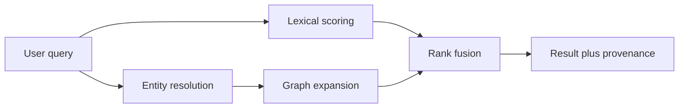

# Semantic Context Demo: Explainable Graph-Augmented Retrieval

[](https://github.com/abhi07gupta/semantic-context-demo/actions/workflows/quality.yml)
[](LICENSE)

A small, runnable demonstration of how semantic context can improve retrieval
without hiding the reasoning behind an embedding or external model API.

The demo indexes synthetic service documents with BM25-style lexical scoring,
resolves entities and aliases from a query, expands through a compact knowledge
graph, and combines lexical relevance with weighted graph proximity. Every
result exposes matched terms, contributing entities, and provenance paths.



## Why this matters

Enterprise questions often depend on relationships that are not repeated in
every document: a service depends on a gateway, a change modifies that gateway,
and a runbook reverses the change. Pure keyword matching can miss the best
evidence when the question and document use different language. Semantic
context makes those relationships explicit while preserving traceability.

## Quick start

```bash
python -m venv .venv
source .venv/bin/activate
python -m pip install -e .
semantic-demo "Why is checkout slow after the gateway change?"
semantic-demo --evaluate
python -m unittest discover -s tests -v
```

No database, model, API key, or third-party Python package is required.

## Result contract

Each result contains:

- total, lexical, and context scores;
- matched lexical terms;
- semantic entities that contributed to the rank;
- graph paths that explain the contribution;
- stable document identifiers for evaluation and downstream citation.

Example queries and evaluation cases live in [`data/`](data/). The evaluation
reports mean reciprocal rank for lexical-only and context-aware retrieval. It is
a regression aid, not a claim about production performance.

## Repository map

```text
src/semantic_context_demo/  retrieval engine, evaluation, CLI
data/                       synthetic documents, graph, test questions
docs/                       architecture and production considerations
tests/                      ranking and evaluation tests
.github/workflows/          multi-version quality gate
```

## Architecture choices

1. **Deterministic retrieval.** A reviewer can reproduce every score locally.
2. **Separable signals.** Lexical and context contributions remain visible.
3. **Graph decay.** Nearer relationships contribute more than distant ones.
4. **Evidence IDs.** Results point to documents rather than synthesizing unsupported answers.
5. **Evaluation first.** The repository includes a small benchmark so ranking changes are measurable.

## Production gaps

A real semantic-context capability needs robust entity resolution, ontology and
schema governance, temporal and regional validity, access-aware traversal,
document-level authorization, quality monitoring, versioned evaluation sets,
data lineage, privacy controls, service ownership, and a safe evolution process.
This demo deliberately keeps those boundaries explicit.

## Public-use note

The domain, entities, relationships, documents, and evaluation set are entirely
synthetic. The code illustrates Abhi Gupta's public approach to semantic
context; it does not disclose employer architecture, data, clients, or systems.

## Author

**Abhi Gupta**: Enterprise AI technical leader and architect based in Stockholm.

[Portfolio](https://abhi07gupta.github.io/) ·
[LinkedIn](https://www.linkedin.com/in/abhi07gupta/) ·
[GitHub](https://github.com/abhi07gupta)
