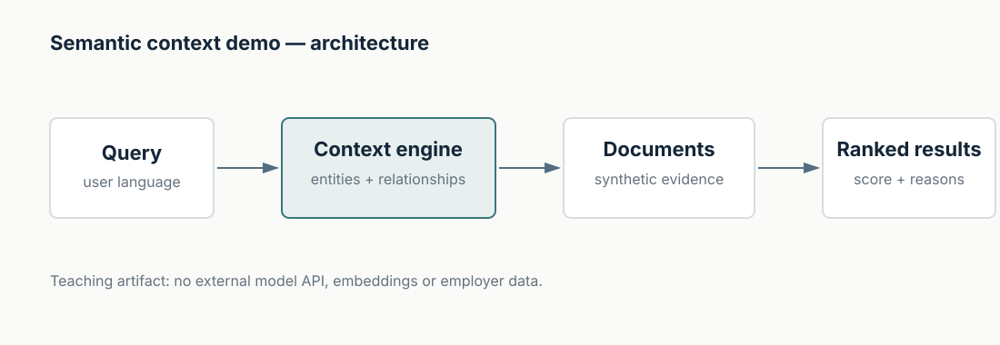

# Semantic Context Demo

A compact, dependency-light demonstration of how **structured enterprise context** can improve retrieval over a small synthetic information domain.

The demo intentionally avoids embeddings and external model APIs. That keeps the architecture visible: a lexical baseline retrieves documents from query words, while the context-aware path expands the query through known entity relationships before ranking evidence.

This is not presented as a replacement for production semantic retrieval. It is a teaching artifact for architecture conversations.

## Synthetic domain
A fictional service organization has:
- products;
- service policies;
- regions;
- known issue categories;
- documents connected to those entities.

## Run

```bash
python examples/run_demo.py
python -m unittest discover -s tests -v
```

No external Python package is required.

## What to observe
A query such as “battery issue for Nova X in Sweden” can use the graph to connect:
- `Nova X` → product family `Nova`;
- `Sweden` → region `Nordics`;
- `battery issue` → issue category `power`;
- applicable policy / troubleshooting documents connected to those concepts.

The baseline sees only overlapping words. The context-aware path can rank relevant documents that use different surface wording but share structured relationships.



## Limits
- Tiny synthetic dataset.
- Hand-authored graph.
- Simple token scoring rather than embeddings.
- No LLM in the loop.

These limits are deliberate: the example isolates the architecture idea without hiding it behind framework complexity.

## Public-safety note
All data and entities are fictional. No employer data, code, architecture or terminology is used.

## License
MIT.
